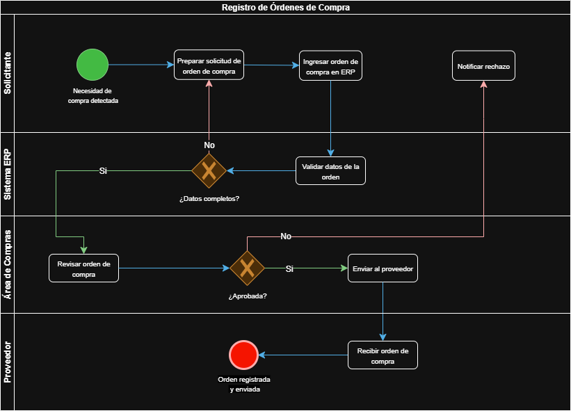

# Informe – Taller 1: Modelado de Proceso con BPMN

## 1. Descripción del proceso
El proceso modelado corresponde al **Registro de Órdenes de Compra** en la empresa cliente.  
Su objetivo es garantizar que las solicitudes de compra se registren, validen y aprueben de forma eficiente, asegurando que únicamente se envíen órdenes completas y aprobadas al proveedor.

### Flujo resumido:
1. **Solicitante** detecta la necesidad de compra, prepara la solicitud y la ingresa en el sistema ERP.
2. **Sistema ERP** valida que los datos estén completos.
3. Si los datos son correctos, la solicitud pasa al **Área de Compras** para revisión y aprobación.
4. Si la orden es aprobada, se envía al **Proveedor**.
5. El proveedor recibe la orden y el proceso finaliza con la orden registrada y enviada.
6. En caso de errores o rechazo, la orden retorna al solicitante para corrección o se notifica el rechazo.

---

## 2. Diferencias con el caso base (Clínica Salud Viva)
| Elemento                 | Caso base: Agendamiento de citas | Cliente: Registro de órdenes de compra |
|---------------------------|----------------------------------|-----------------------------------------|
| Roles/Lanes               | Paciente, Sistema de citas, Base de datos, Servicio de notificaciones | Solicitante, Sistema ERP, Área de Compras, Proveedor |
| Gateways                  | Disponibilidad y confirmación   | Validación de datos y aprobación de compra |
| Interacción externa       | Notificación por correo/SMS     | Envío de orden al proveedor |
| Ciclo de corrección       | No presente                     | Presente (cuando datos incompletos) |
| Evento final              | Cita registrada                 | Orden registrada y enviada |

**Justificación:** El proceso de órdenes de compra requiere más actores y verificaciones, así como interacción directa con un tercero externo (proveedor), lo cual no ocurre en el agendamiento de citas.

---

## 3. Buenas prácticas BPMN aplicadas
- **Nombres claros en verbo + sustantivo** para las actividades (ej. “Validar datos de la orden” en vez de “Validación”).
- **Pools y lanes definidos** por actor para mayor claridad en responsabilidades.
- **Uso de gateways exclusivos** (X) para decisiones con rutas Sí/No claramente etiquetadas.
- **Inicio y fin únicos** y bien diferenciados con eventos específicos.
- **Flujos sin cruces innecesarios**, manteniendo legibilidad.
- Inclusión de **bucles de retroalimentación** para manejo de errores (datos incompletos o orden rechazada).

---

## 4. Captura del modelo

---

## 5. Conclusión
El modelado BPMN permitió visualizar claramente las etapas y responsables del proceso de registro de órdenes de compra.  
Este diagrama facilita la identificación de puntos de mejora como:
- Automatizar notificaciones de rechazo.
- Reducir el tiempo de validación de datos.
- Integrar el ERP con el sistema del proveedor para agilizar el envío.

---
