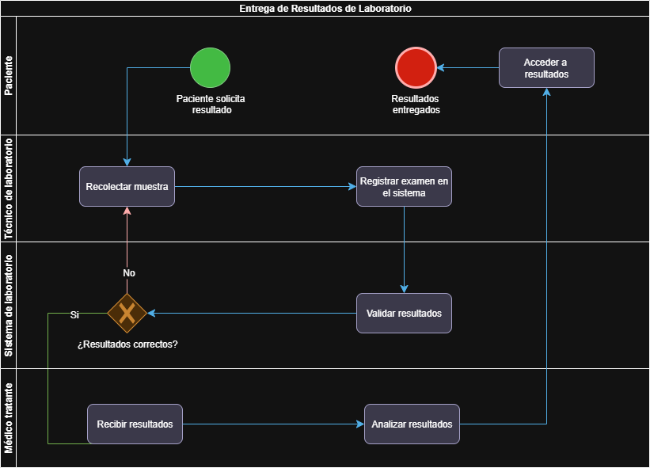

# Informe – Taller 1: Modelado de Proceso con BPMN

## 1. Descripción del proceso
El proceso modelado corresponde a la **Entrega de Resultados de Laboratorio** en una organización del sector salud con múltiples sedes.  
Su objetivo es asegurar que los resultados de los exámenes de laboratorio sean entregados de manera oportuna y precisa al paciente y al médico tratante, minimizando errores y retrasos causados por problemas en los sistemas.

### Flujo resumido:
1. **Paciente** solicita los resultados de un examen.
2. **Técnico de laboratorio** recolecta la muestra y registra el examen en el sistema.
3. **Sistema de laboratorio** valida los resultados.
4. Si los resultados presentan inconsistencias:
   - Se notifica al técnico para repetir la recolección de la muestra.
5. Si los resultados son correctos:
   - Se envían al **médico tratante** para su análisis.
6. **Paciente** accede a los resultados.
7. El proceso finaliza con los **resultados entregados**.

---

## 2. Diferencias con el caso base (Clínica Salud Viva)
| Elemento                 | Caso base: Agendamiento de citas | Cliente: Entrega de resultados de laboratorio |
|---------------------------|----------------------------------|-----------------------------------------------|
| Roles/Lanes               | Paciente, Sistema de citas, Base de datos, Servicio de notificaciones | Paciente, Técnico de laboratorio, Sistema de laboratorio, Médico tratante |
| Gateways                  | Disponibilidad y confirmación   | Validación de resultados correctos |
| Interacción externa       | Notificación al paciente         | Entrega de resultados al médico y acceso por el paciente |
| Ciclo de corrección       | No presente                     | Presente (si resultados incorrectos) |
| Evento final              | Cita registrada                 | Resultados entregados |

**Justificación:**  
El proceso de entrega de resultados está orientado al flujo de información y validación de calidad, en lugar de a la coordinación de agendas. Además, involucra a un médico tratante y maneja un flujo alterno en caso de errores en los resultados.

---

## 3. Buenas prácticas BPMN aplicadas
- **Nombres claros en verbo + sustantivo** para todas las actividades (ej. “Validar resultados”, “Recolectar muestra”).
- **Pools y lanes bien definidos** según actores.
- **Uso de gateways exclusivos** (X) para decisiones con rutas Sí/No claramente etiquetadas.
- **Inicio y fin únicos** y claramente identificados.
- **Flujo lineal y legible**, minimizando cruces.
- Inclusión de **bucles de retroalimentación** para manejar casos de resultados incorrectos.

---

## 4. Captura del modelo
## 4. Captura del modelo

---

## 5. Conclusión
El modelado BPMN permitió representar de forma clara y ordenada las etapas y responsables del proceso de entrega de resultados de laboratorio.  
Este modelo facilita la identificación de puntos de mejora como:
- Implementar alertas automáticas cuando los resultados no sean correctos.
- Integrar el sistema de laboratorio con el historial clínico del paciente.
- Reducir tiempos de entrega mediante automatización de notificaciones.

---
